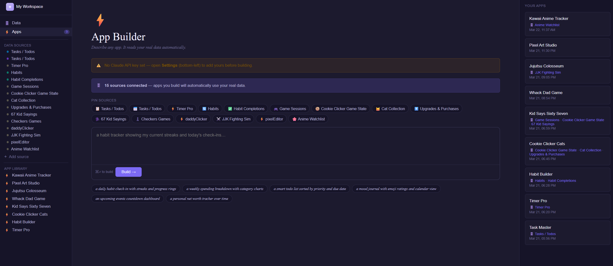

# Mugen — AI Data and App Integrator

**Mugen** is an AI-powered personal productivity app generator built at HooHacks 2026. Describe any app you want — a habit tracker, spending dashboard, mood journal — and Mugen builds it instantly as a fully functional React app, pre-filled with your own real data. Basically imagine Notion but with an AI powered application layer where you can take your databases and use them together to make tailored frontends and interfaces to use your data in customizable and tailored ways.

**Live at:** [mugenai.vercel.app](https://mugenai.vercel.app)
**Demo at:** [mugenai.youtube.com](https://www.youtube.com/watch?v=IWGsVBW25Lc)

<p align="center">
  
</p>

---

## What it does

Most productivity apps force you into their structure. Mugen flips that: you bring your data, describe what you want, and Claude builds the app around you.

### Data Sources

Create structured data sources across six categories: Tasks, Habits, Finances, Notes, Calendar, and Custom. Paste in raw text — a to-do list, a spreadsheet dump, anything — and Claude infers the schema and parses all your records automatically. You can then edit records inline in a spreadsheet-style table, add fields on the fly, and manage everything from one place.

### App Builder

Describe any app in plain English. "A habit tracker with streaks and progress rings." "A weekly spending breakdown with category charts." "An upcoming events countdown dashboard." Claude plans which of your data sources are relevant, links them automatically, and generates a complete self-contained HTML5 app. Apps read your live data from Supabase on every load and write changes back in real time. You can also pin specific sources to force them into the generated app, and all your previously generated apps are saved to the library for instant relaunch.

### Inline App Editing

Open any app and describe a change — "add a priority filter", "change the accent color to blue", "show a streak counter at the top". Claude edits the existing app in place, preserving your design and data connections. If your edit requires a new field that doesn't exist yet (e.g. "add notes to each expense"), Claude updates your data source schema automatically.

### AI Narration

While your app is being generated, Claude's extended thinking is narrated aloud in real time. The narrator speaks in the voice of the Jujutsu Kaisen announcer, framing every engineering decision as a cursed technique being deployed. Powered by ElevenLabs streaming TTS with the Web Audio API for gapless playback.

---

## How it works

```
User prompt
    │
    ├─► Claude plans data sources (tool use)
    │       Links relevant existing sources, creates new ones if needed
    │
    ├─► Claude generates the app (extended thinking + streaming)
    │       Extended thinking → narration pipeline (Haiku → ElevenLabs → browser audio)
    │       Text output → complete self-contained HTML5 React app
    │
    └─► App loads in a sandboxed iframe
            window.vibeDB injected with your live records before load
            postMessage bridge syncs any writes back to Supabase
```

**vibeDB bridge** — the mechanism that connects generated apps to your real data:
- **Read**: `window.vibeDB["Source Name"].records` — injected into the iframe before it loads
- **Write**: `window.parent.postMessage({ type: 'vibeDB:write', sourceName, records }, '*')` — parent picks this up and syncs to Supabase

---

## Stack

| Layer | Tech |
|---|---|
| Frontend | React 19 + TypeScript + Vite |
| Backend | Python + FastAPI |
| AI | Anthropic SDK — Claude Sonnet 4.5 (app gen, extended thinking) + Claude Haiku 4.5 (schema inference, naming, narration rewrite) |
| TTS | ElevenLabs streaming (`eleven_flash_v2_5`, Brian voice) |
| Database + Auth | Supabase (PostgreSQL + Row-Level Security) |
| Hosting | Vercel (frontend) |

---

## Local setup

### Prerequisites

- Python 3.11+
- Node.js 18+
- A [Supabase](https://supabase.com) project
- An [Anthropic API key](https://console.anthropic.com)
- An [ElevenLabs API key](https://elevenlabs.io) (optional — disables narration if absent)

---

### 1. Clone the repo

```bash
git clone https://github.com/your-username/hoohacks-2026.git
cd hoohacks-2026
```

### 2. Backend setup

```bash
cd backend
python -m venv venv
source venv/Scripts/activate   # Windows (Git Bash)
# source venv/bin/activate     # macOS / Linux

pip install -r requirements.txt
```

Create `backend/.env`:

```env
ANTHROPIC_API_KEY=sk-ant-...
ELEVENLABS_API_KEY=sk_...        # optional — disabling omits TTS narration
ALLOWED_ORIGINS=http://localhost:5173
```

Start the dev server:

```bash
python -m uvicorn main:app --reload
# API at http://localhost:8000
# Swagger docs at http://localhost:8000/docs
```

### 3. Frontend setup

```bash
cd frontend
npm install
```

Create `frontend/.env`:

```env
VITE_SUPABASE_URL=https://your-project.supabase.co
VITE_SUPABASE_ANON_KEY=eyJ...
VITE_API_URL=http://localhost:8000
```

Start the dev server:

```bash
npm run dev
# App at http://localhost:5173
```

### 4. Supabase schema

Run this in your Supabase SQL editor:

```sql
create table sources (
  id uuid primary key default gen_random_uuid(),
  user_id uuid references auth.users not null,
  name text not null,
  type text not null,
  icon text,
  fields jsonb not null default '[]',
  created_at timestamptz default now()
);

create table records (
  id uuid primary key default gen_random_uuid(),
  source_id uuid references sources on delete cascade not null,
  user_id uuid references auth.users not null,
  data jsonb not null default '{}',
  position integer default 0
);

create table apps (
  id uuid primary key default gen_random_uuid(),
  user_id uuid references auth.users not null,
  name text not null,
  prompt text,
  html text,
  source_ids uuid[] default '{}',
  created_at timestamptz default now()
);

-- Row-Level Security
alter table sources enable row level security;
alter table records enable row level security;
alter table apps enable row level security;

create policy "Users own their sources" on sources for all using (auth.uid() = user_id);
create policy "Users own their records" on records for all using (auth.uid() = user_id);
create policy "Users own their apps"    on apps    for all using (auth.uid() = user_id);
```

---

## Using your own Anthropic key

On the hosted version at [mugenai.vercel.app](https://mugenai.vercel.app), open **Settings** and enter your Anthropic API key. It's sent as an `X-Anthropic-Key` header on each request and never stored server-side.

---

## API reference

| Method | Endpoint | Description |
|---|---|---|
| `POST` | `/api/infer-schema` | Parse raw text into structured fields + records via Claude |
| `POST` | `/api/generate-app-stream` | Generate a new app — SSE stream of audio chunks then final result |
| `POST` | `/api/edit-app-stream` | Edit an existing app — SSE stream of audio chunks then final result |
| `GET`  | `/health` | Health check |

### SSE event types

Both streaming endpoints emit Server-Sent Events:

```
data: {"type": "audio", "data": "<base64 PCM>"}   // narration audio chunk
data: {"type": "result", "html": "...", ...}        // final app HTML
data: {"type": "error", "detail": "..."}            // on failure
data: [DONE]                                         // stream end
```

---

## Project structure

```
hoohacks-2026/
├── backend/
│   ├── main.py            # All API routes and Claude integration
│   ├── tts_narrator.py    # Streaming TTS narration pipeline
│   ├── requirements.txt
│   └── runtime.txt
└── frontend/
    └── src/
        ├── pages/
        │   ├── BuildPage.tsx   # App builder, vibeDB bridge, app library
        │   ├── DataPage.tsx    # Source and record management
        │   └── AuthPage.tsx    # Supabase auth
        ├── lib/
        │   ├── ai.ts           # Backend API calls
        │   └── supabase.ts     # Supabase client
        └── types.ts            # Shared TypeScript types
```

---

Built at HooHacks 2026.
